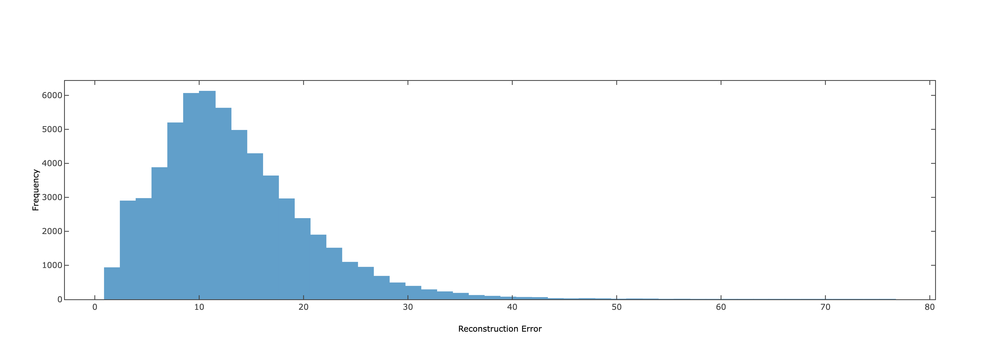
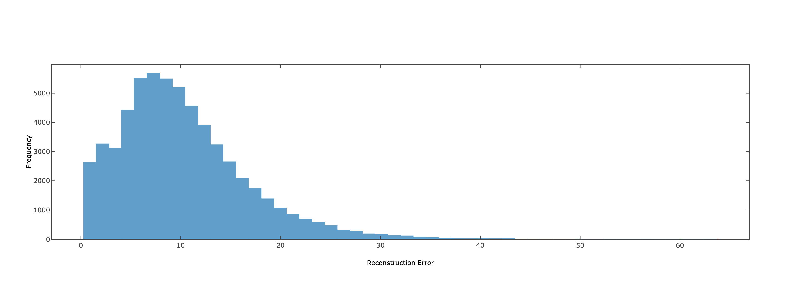
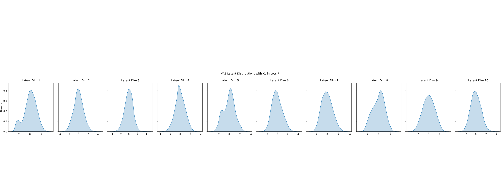
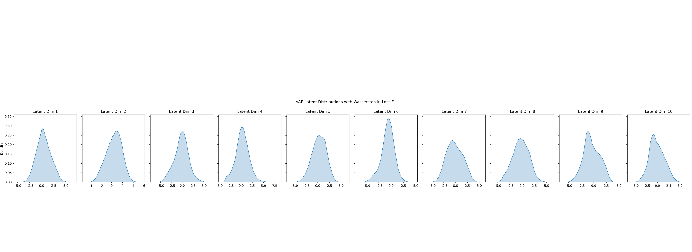
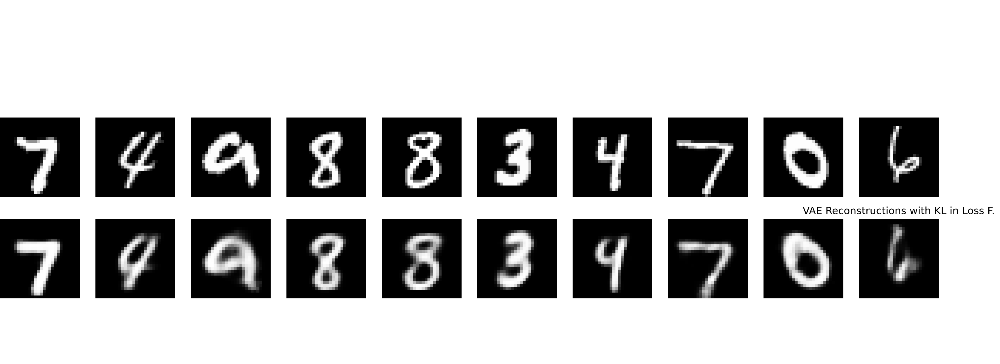
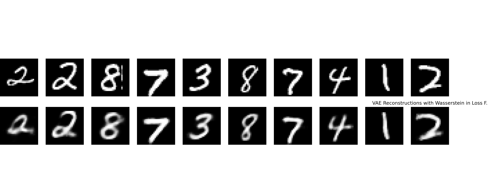
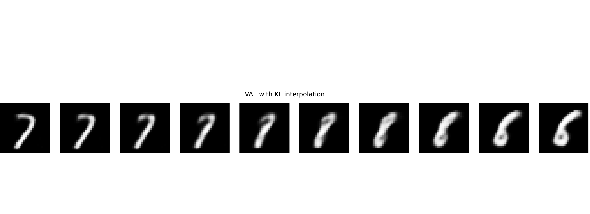
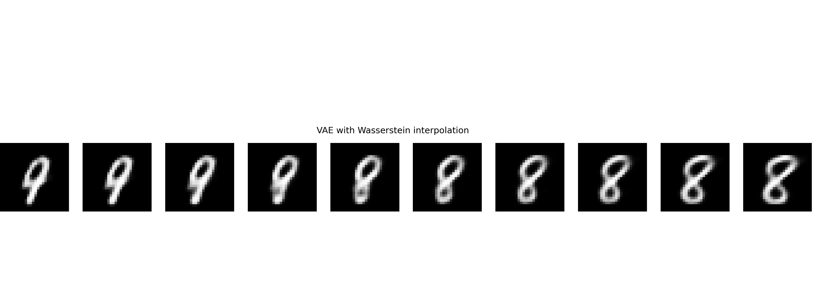
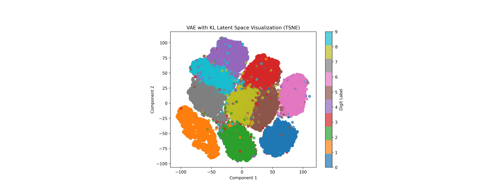
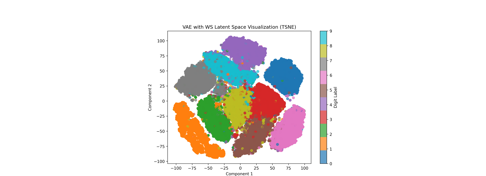

# Experiment Report: VAE with KL vs. Wasserstein Loss

## Introduction

This report summarizes the results of an experiment comparing the performance of a Variational Autoencoder (VAE) trained with two different loss functions: KL divergence and the Wasserstein metric. The experiment was conducted on the MNIST dataset, which consists of 28x28 grayscale images of handwritten digits.

## Methodology

### Model Architecture

- **VAE Architecture:**
  - **Encoder:** A simple feedforward neural network with two layers (256 and 10 units) to output the mean and log-variance of the latent distribution.
  - **Decoder:** A feedforward neural network with two layers (256 and 784 units) to reconstruct the input images.
  - **Latent Space:** 10-dimensional.

- **Wasserstein Loss Implementation:**
  - **Critic Network:** A feedforward neural network with three layers (512, 256, and 10 units) to estimate the Wasserstein distance between the latent distribution and the prior.

### Training Details

- **Dataset:** MNIST
- **Batch Size:** 64
- **Learning Rate:** 1e-3 for both VAE and critic networks.
- **Epochs:** 35
- **Loss Functions:**
  - **KL Divergence Loss:** Combines reconstruction loss (BCE) and KL divergence.
  - **Wasserstein Loss:** Combines reconstruction loss and the Wasserstein distance estimated by the critic network, with a gradient penalty to enforce Lipschitz continuity.

## Results

### Reconstruction Error Distribution

$$KL$$

$$WS$$

- **KL Divergence:**
  - The reconstruction error distribution shows a wide range of errors, with a peak around 30. This suggests that while the model can reconstruct most images reasonably well, there is a significant variance in reconstruction quality.

- **Wasserstein Metric:**
  - The reconstruction error distribution is slightly narrower and peaks around 20, indicating generally better reconstruction quality compared to the KL divergence model.

### Latent Distributions

- **KL Divergence:**
  - The latent distributions are well-centered around zero and have a Gaussian-like shape, as expected when using KL divergence to match a standard Gaussian prior.

- **Wasserstein Metric:**
  - The latent distributions are less centered and show more variability. This could indicate that the Wasserstein loss is allowing for a more flexible latent space structure.

### Reconstruction Quality

- **KL Divergence:**
  - The reconstructions are generally good, with clear digits, but some reconstructions show blurriness or artifacts.

- **Wasserstein Metric:**
  - The reconstructions are sharper and more detailed, with fewer artifacts compared to the KL divergence model.

### Interpolation

- **KL Divergence:**
  - The interpolation between digits is smooth, with gradual transitions between classes.

- **Wasserstein Metric:**
  - The interpolation is also smooth, with even more coherent transitions between digits.

### Latent Space Visualization (t-SNE)

1. **KL Divergence Model:**
   - **Latent Space Visualization:**
     - The t-SNE plot shows well-separated and tightly packed clusters, indicating that the model effectively learns distinct representations for each digit class.
   - **Implications:**
     - The clear separation suggests that similar inputs are close in the latent space, which could be beneficial for tasks requiring precise generation or classification.
     - However, the strict adherence to a Gaussian prior might limit the model's expressiveness and flexibility.

2. **Wasserstein Metric Model:**
   - **Latent Space Visualization:**
     - The t-SNE plot reveals more spread-out clusters with wider spaces between them, suggesting a more diverse and flexible latent space.
   - **Implications:**
     - The wider spaces might indicate that the model captures nuanced variations within each class, potentially leading to richer data representations.
     - This flexibility could enhance generalization by allowing the model to learn from a broader range of data distributions.
     
## Discussion

### Reconstruction Error

The Wasserstein metric model shows a lower and more consistent reconstruction error compared to the KL divergence model. This suggests that the Wasserstein loss may be more effective in minimizing the reconstruction error, leading to better quality reconstructions.

### Latent Space Structure

The KL divergence model enforces a stricter prior on the latent space, leading to well-behaved and Gaussian-like latent distributions. In contrast, the Wasserstein metric allows for more flexibility in the latent space, which may lead to better generalization but at the cost of a more complex latent structure.

### Interpolation and Generalization

The smoother and more coherent interpolations produced by the Wasserstein metric model suggest that it may generalize better to unseen data, as it can interpolate more effectively between different data points in the latent space.

## Conclusion

The experiment demonstrates that using the Wasserstein metric in place of KL divergence in the VAE loss function can lead to improved reconstruction quality and smoother interpolations, albeit with a potentially more complex latent space structure. Further experiments with different hyperparameters and architectures could provide more insights into the benefits and trade-offs of using the Wasserstein metric in VAEs.
